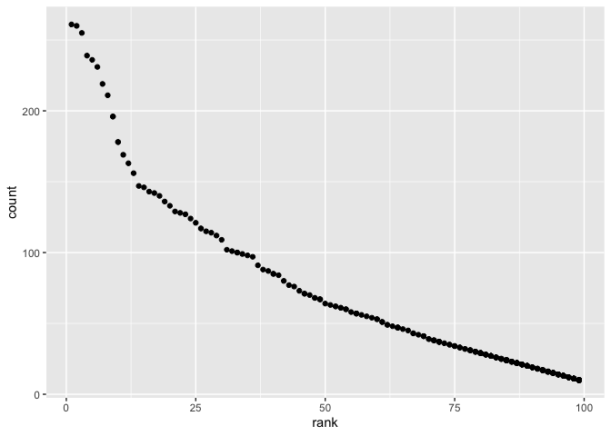

p8105\_hw2\_amh2325
================
Amanda Howarth
10/2/2019

## R Markdown

``` r
library(tidyverse)
```

    ## ── Attaching packages ─────────────────────────────────────────────────────── tidyverse 1.2.1 ──

    ## ✔ ggplot2 3.2.1     ✔ purrr   0.3.2
    ## ✔ tibble  2.1.3     ✔ dplyr   0.8.3
    ## ✔ tidyr   1.0.0     ✔ stringr 1.4.0
    ## ✔ readr   1.3.1     ✔ forcats 0.4.0

    ## ── Conflicts ────────────────────────────────────────────────────────── tidyverse_conflicts() ──
    ## ✖ dplyr::filter() masks stats::filter()
    ## ✖ dplyr::lag()    masks stats::lag()

``` r
library(readxl)
```

## Problem 1

## Import trash\_wheels data sheet 1

``` r
trash_wheels_data =
  read_excel(path = "./data/trash_wheel.xlsx", sheet = 1) %>%
  janitor::clean_names() %>%
  drop_na(dumpster) %>%
  select(-15, -16, -17) %>%
  mutate(sports_balls = as.integer(sports_balls))
```

    ## New names:
    ## * `` -> ...15
    ## * `` -> ...16
    ## * `` -> ...17

``` r
trash_wheels_data
```

    ## # A tibble: 344 x 14
    ##    dumpster month  year date                weight_tons volume_cubic_ya…
    ##       <dbl> <chr> <dbl> <dttm>                    <dbl>            <dbl>
    ##  1        1 May    2014 2014-05-16 00:00:00        4.31               18
    ##  2        2 May    2014 2014-05-16 00:00:00        2.74               13
    ##  3        3 May    2014 2014-05-16 00:00:00        3.45               15
    ##  4        4 May    2014 2014-05-17 00:00:00        3.1                15
    ##  5        5 May    2014 2014-05-17 00:00:00        4.06               18
    ##  6        6 May    2014 2014-05-20 00:00:00        2.71               13
    ##  7        7 May    2014 2014-05-21 00:00:00        1.91                8
    ##  8        8 May    2014 2014-05-28 00:00:00        3.7                16
    ##  9        9 June   2014 2014-06-05 00:00:00        2.52               14
    ## 10       10 June   2014 2014-06-11 00:00:00        3.76               18
    ## # … with 334 more rows, and 8 more variables: plastic_bottles <dbl>,
    ## #   polystyrene <dbl>, cigarette_butts <dbl>, glass_bottles <dbl>,
    ## #   grocery_bags <dbl>, chip_bags <dbl>, sports_balls <int>,
    ## #   homes_powered <dbl>

## Import precipitation\_2018 data

``` r
precipitation_2018_data = 
  read_excel(path = "./data/trash_wheel.xlsx", sheet = 6, range = "A2:B14") %>%
  janitor::clean_names() %>%
  mutate(year = 2018)
precipitation_2018_data
```

    ## # A tibble: 12 x 3
    ##    month total  year
    ##    <dbl> <dbl> <dbl>
    ##  1     1  2.34  2018
    ##  2     2  1.46  2018
    ##  3     3  3.57  2018
    ##  4     4  3.99  2018
    ##  5     5  5.64  2018
    ##  6     6  1.4   2018
    ##  7     7  7.09  2018
    ##  8     8  4.44  2018
    ##  9     9  1.95  2018
    ## 10    10  0     2018
    ## 11    11  0.11  2018
    ## 12    12  0.94  2018

## Import precipitation\_2017 data

``` r
precipitation_2017_data = 
  read_excel(path = "./data/trash_wheel.xlsx", sheet = 5, range = "A2:B14") %>%
  janitor::clean_names() %>%
  mutate(year = 2017)
precipitation_2017_data
```

    ## # A tibble: 12 x 3
    ##    month total  year
    ##    <dbl> <dbl> <dbl>
    ##  1     1  0.94  2017
    ##  2     2  4.8   2017
    ##  3     3  2.69  2017
    ##  4     4  4.69  2017
    ##  5     5  9.27  2017
    ##  6     6  4.77  2017
    ##  7     7 10.2   2017
    ##  8     8  6.45  2017
    ##  9     9 10.5   2017
    ## 10    10  2.12  2017
    ## 11    11  7.82  2017
    ## 12    12  6.11  2017

## Joining datasets to form precipiation\_join data

``` r
precipitation_join = 
  full_join(precipitation_2018_data, precipitation_2017_data) %>%
  mutate(month = as.numeric(month), month = month.name[month])
```

    ## Joining, by = c("month", "total", "year")

``` r
precipitation_join
```

    ## # A tibble: 24 x 3
    ##    month     total  year
    ##    <chr>     <dbl> <dbl>
    ##  1 January    2.34  2018
    ##  2 February   1.46  2018
    ##  3 March      3.57  2018
    ##  4 April      3.99  2018
    ##  5 May        5.64  2018
    ##  6 June       1.4   2018
    ##  7 July       7.09  2018
    ##  8 August     4.44  2018
    ##  9 September  1.95  2018
    ## 10 October    0     2018
    ## # … with 14 more rows

## Dataset summaries

Write a paragraph about these data; you are encouraged to use inline R.
Be sure to note the number of observations in both resulting datasets,
and give examples of key variables. For available data, what was the
total precipitation in 2018? What was the median number of sports balls
in a dumpster in 2017?

The `trash_wheels_data` includes information regarding the trash
collected by Mr. Trash Wheel (water wheel vessel), which is immediately
dumped into a dumpster sitting on a separate barge at the back of the
device. There are 344 observations and 14 variables in
`trash_wheel_data`. Key variables include weight\_tons (weight in tons)
and volume\_cubic\_yards (volume in cubic yards of trash in each
dumpster).

The `precipitation_join` dataset includes information on rainfall in the
months of 2017 and 2018. The amount of trash the device receives is
highly dependent on rainfall.There are 24 observations and 3 in
`precipitation_join`. A key variable is “total”, which measures the
rainfall in inches per month in a year.

For available data, the total precipiation in 2018 was 32.93.In 2017,
the median number of sports balls found in a dumpster was 8.

## Problem 2

## Import pols\_month data

``` r
pols_month_data = read_csv("./data/pols-month.csv") %>%
  janitor::clean_names() %>%
  separate(mon, into = c("year", "month", "day")) %>%
  mutate(month = as.numeric(month), month = month.abb[month], month=str_to_lower(month)) %>%
  mutate(year = as.numeric(year))%>%
  mutate(president = ifelse(prez_dem, "dem", "gop")) %>%
  select(-prez_dem, -prez_gop, -day)
```

    ## Parsed with column specification:
    ## cols(
    ##   mon = col_date(format = ""),
    ##   prez_gop = col_double(),
    ##   gov_gop = col_double(),
    ##   sen_gop = col_double(),
    ##   rep_gop = col_double(),
    ##   prez_dem = col_double(),
    ##   gov_dem = col_double(),
    ##   sen_dem = col_double(),
    ##   rep_dem = col_double()
    ## )

``` r
pols_month_data
```

    ## # A tibble: 822 x 9
    ##     year month gov_gop sen_gop rep_gop gov_dem sen_dem rep_dem president
    ##    <dbl> <chr>   <dbl>   <dbl>   <dbl>   <dbl>   <dbl>   <dbl> <chr>    
    ##  1  1947 jan        23      51     253      23      45     198 dem      
    ##  2  1947 feb        23      51     253      23      45     198 dem      
    ##  3  1947 mar        23      51     253      23      45     198 dem      
    ##  4  1947 apr        23      51     253      23      45     198 dem      
    ##  5  1947 may        23      51     253      23      45     198 dem      
    ##  6  1947 jun        23      51     253      23      45     198 dem      
    ##  7  1947 jul        23      51     253      23      45     198 dem      
    ##  8  1947 aug        23      51     253      23      45     198 dem      
    ##  9  1947 sep        23      51     253      23      45     198 dem      
    ## 10  1947 oct        23      51     253      23      45     198 dem      
    ## # … with 812 more rows

## Import standard\_poor\_stock data

``` r
standard_poor_stock_data = read_csv("./data/snp.csv") %>%
  janitor::clean_names() %>%
  separate(date, c("month", "day", "year")) %>%
  select(year, month, -day, close) %>%
  mutate(year = as.numeric(year)) %>%
  mutate(month = as.numeric(month), month = month.abb[month], month=str_to_lower(month))
```

    ## Parsed with column specification:
    ## cols(
    ##   date = col_character(),
    ##   close = col_double()
    ## )

``` r
standard_poor_stock_data
```

    ## # A tibble: 787 x 3
    ##     year month close
    ##    <dbl> <chr> <dbl>
    ##  1  2015 jul   2080.
    ##  2  2015 jun   2063.
    ##  3  2015 may   2107.
    ##  4  2015 apr   2086.
    ##  5  2015 mar   2068.
    ##  6  2015 feb   2104.
    ##  7  2015 jan   1995.
    ##  8  2014 dec   2059.
    ##  9  2014 nov   2068.
    ## 10  2014 oct   2018.
    ## # … with 777 more rows

## Import unemployment data

``` r
unemployment_data = read_csv("./data/unemployment.csv") %>%
  janitor::clean_names() %>%
  pivot_longer((jan:dec), names_to = "month", values_to ="percent_unemployed")
```

    ## Parsed with column specification:
    ## cols(
    ##   Year = col_double(),
    ##   Jan = col_double(),
    ##   Feb = col_double(),
    ##   Mar = col_double(),
    ##   Apr = col_double(),
    ##   May = col_double(),
    ##   Jun = col_double(),
    ##   Jul = col_double(),
    ##   Aug = col_double(),
    ##   Sep = col_double(),
    ##   Oct = col_double(),
    ##   Nov = col_double(),
    ##   Dec = col_double()
    ## )

``` r
unemployment_data
```

    ## # A tibble: 816 x 3
    ##     year month percent_unemployed
    ##    <dbl> <chr>              <dbl>
    ##  1  1948 jan                  3.4
    ##  2  1948 feb                  3.8
    ##  3  1948 mar                  4  
    ##  4  1948 apr                  3.9
    ##  5  1948 may                  3.5
    ##  6  1948 jun                  3.6
    ##  7  1948 jul                  3.6
    ##  8  1948 aug                  3.9
    ##  9  1948 sep                  3.8
    ## 10  1948 oct                  3.7
    ## # … with 806 more rows

## Merge standard\_poor\_stock\_data and pols\_month\_data to form snp\_pols\_data

``` r
snp_pols_data = 
  left_join(pols_month_data, standard_poor_stock_data, by = c("year", "month"))
snp_pols_data
```

    ## # A tibble: 822 x 10
    ##     year month gov_gop sen_gop rep_gop gov_dem sen_dem rep_dem president
    ##    <dbl> <chr>   <dbl>   <dbl>   <dbl>   <dbl>   <dbl>   <dbl> <chr>    
    ##  1  1947 jan        23      51     253      23      45     198 dem      
    ##  2  1947 feb        23      51     253      23      45     198 dem      
    ##  3  1947 mar        23      51     253      23      45     198 dem      
    ##  4  1947 apr        23      51     253      23      45     198 dem      
    ##  5  1947 may        23      51     253      23      45     198 dem      
    ##  6  1947 jun        23      51     253      23      45     198 dem      
    ##  7  1947 jul        23      51     253      23      45     198 dem      
    ##  8  1947 aug        23      51     253      23      45     198 dem      
    ##  9  1947 sep        23      51     253      23      45     198 dem      
    ## 10  1947 oct        23      51     253      23      45     198 dem      
    ## # … with 812 more rows, and 1 more variable: close <dbl>

## Merge unemployment\_data and snp\_pols\_data into snp\_pols\_unemp\_data

``` r
snp_pols_unemp_data =
    left_join(snp_pols_data, unemployment_data, by = c("year", "month"))
snp_pols_unemp_data
```

    ## # A tibble: 822 x 11
    ##     year month gov_gop sen_gop rep_gop gov_dem sen_dem rep_dem president
    ##    <dbl> <chr>   <dbl>   <dbl>   <dbl>   <dbl>   <dbl>   <dbl> <chr>    
    ##  1  1947 jan        23      51     253      23      45     198 dem      
    ##  2  1947 feb        23      51     253      23      45     198 dem      
    ##  3  1947 mar        23      51     253      23      45     198 dem      
    ##  4  1947 apr        23      51     253      23      45     198 dem      
    ##  5  1947 may        23      51     253      23      45     198 dem      
    ##  6  1947 jun        23      51     253      23      45     198 dem      
    ##  7  1947 jul        23      51     253      23      45     198 dem      
    ##  8  1947 aug        23      51     253      23      45     198 dem      
    ##  9  1947 sep        23      51     253      23      45     198 dem      
    ## 10  1947 oct        23      51     253      23      45     198 dem      
    ## # … with 812 more rows, and 2 more variables: close <dbl>,
    ## #   percent_unemployed <dbl>

## Dataset summaries

`pols_month_data` has 822 observations with 9 variables. The dataset
provides us with information regarding the number of national
politicians who are democratic or republican at any given month ranging
from 1947 to 2015. Key variables include president, which tells us
whether the president serving was democratic or republican in a given
year and month. Other key variables include gov\_gop, sen\_gop,
rep\_gop, gov\_dem, sen\_dem, and rep\_dem.

`standard_poor_stock_data` has 787 observations with 3 variables. The
dataset provides us with information related to Standard & Poor’s stock
market index (S\&P), ranging from 1950 to 2015. A key variable is
“close,” which is the closing values of the S\&P stock index during
the associated month and year.

`unemployment_data` has 816 observations with 3 variables. The dataset
provides us with the percentage of unemployment in the United States at
a specific month and year, ranging from 1948 to 2015. A key variable is
percent\_unemployed.

`snp_pols_data` has 822 observations with 10 variables. The dataset
joined `pols_month_data` and `standard_poor_stock_data`, providing us
with information regarding the number of national politicians who are
democratic or republican in a specific month and year as well as the
closing values of the S\&P stock index on the associated date. This
dataset ranged in year from 1947 to 2015. Key variables are: sen\_gop,
rep\_gop, sen\_dem, rep\_dem, president, and close.

`snp_pols_unemp_data` has 822 observations with 11 variables. The
dataset joined `snp_pols_data` and `unemployment_data`, providing us
with information regarding the number of national politicians who are
democratic or republican in a specific month and year as well as the
closing values of the S\&P stock index and percentage of unemployment in
the US on the associated date. This dataset ranged in year from 1947 to
2015. Key variables are: sen\_gop, rep\_gop, sen\_dem, rep\_dem,
president, close, and percent\_unemployed.

## Problem 3

## Import baby names data

``` r
baby_names_data = read_csv("./data/Popular_Baby_Names.csv") %>%
  distinct() %>%
  janitor::clean_names() %>%
  mutate(ethnicity = recode(ethnicity, "ASIAN AND PACI" = "ASIAN AND PACIFIC ISLANDER", "BLACK NON HISP" = "BLACK NON HISPANIC", "WHITE NON HISP" = "WHITE NON HISPANIC")) %>%
  mutate(ethnicity = str_to_lower(ethnicity), gender = str_to_lower(gender), childs_first_name = str_to_lower(childs_first_name))
```

    ## Parsed with column specification:
    ## cols(
    ##   `Year of Birth` = col_double(),
    ##   Gender = col_character(),
    ##   Ethnicity = col_character(),
    ##   `Child's First Name` = col_character(),
    ##   Count = col_double(),
    ##   Rank = col_double()
    ## )

## Table showing the rank in popularity of the name “Olivia” as a female baby name over time.

``` r
baby_names_data %>%
filter(childs_first_name == "olivia") %>%
  select(-count) %>%
  pivot_wider(names_from = year_of_birth,
              values_from = rank)
```

    ## # A tibble: 4 x 9
    ##   gender ethnicity childs_first_na… `2016` `2015` `2014` `2013` `2012`
    ##   <chr>  <chr>     <chr>             <dbl>  <dbl>  <dbl>  <dbl>  <dbl>
    ## 1 female asian an… olivia                1      1      1      3      3
    ## 2 female black no… olivia                8      4      8      6      8
    ## 3 female hispanic  olivia               13     16     16     22     22
    ## 4 female white no… olivia                1      1      1      1      4
    ## # … with 1 more variable: `2011` <dbl>

## Table showing the most popular name among male children over time.

``` r
baby_names_data %>%
filter(gender == "male", rank == 1) %>%
  select(-count) %>%
  pivot_wider(names_from = year_of_birth,
              values_from = rank)
```

    ## # A tibble: 11 x 9
    ##    gender ethnicity childs_first_na… `2016` `2015` `2014` `2013` `2012`
    ##    <chr>  <chr>     <chr>             <dbl>  <dbl>  <dbl>  <dbl>  <dbl>
    ##  1 male   asian an… ethan                 1     NA     NA     NA     NA
    ##  2 male   black no… noah                  1      1     NA     NA     NA
    ##  3 male   hispanic  liam                  1      1      1     NA     NA
    ##  4 male   white no… joseph                1     NA      1     NA      1
    ##  5 male   asian an… jayden               NA      1      1      1     NA
    ##  6 male   white no… david                NA      1     NA      1     NA
    ##  7 male   black no… ethan                NA     NA      1      1     NA
    ##  8 male   hispanic  jayden               NA     NA     NA      1      1
    ##  9 male   asian an… ryan                 NA     NA     NA     NA      1
    ## 10 male   black no… jayden               NA     NA     NA     NA      1
    ## 11 male   white no… michael              NA     NA     NA     NA     NA
    ## # … with 1 more variable: `2011` <dbl>

## For male, white non-hispanic children born in 2016, produce a scatter plot showing the number of children with a name (y axis) against the rank in popularity of that name (x axis).

``` r
baby_names_plot = filter(baby_names_data, ethnicity == "white non hispanic", year_of_birth == "2016", gender == "male")
ggplot(baby_names_plot, aes(x = rank, y = count)) + geom_point() 
```

<!-- -->
